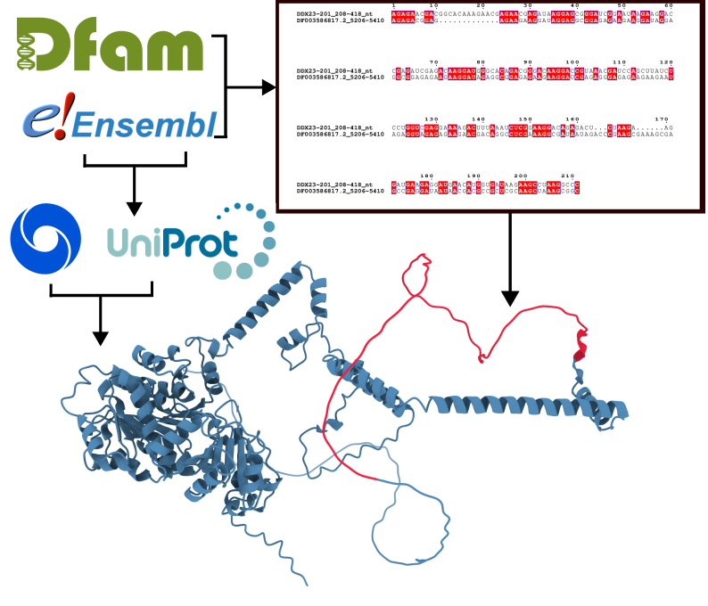

# Transposable elements as evolutionary substrates of protein disorder in the human proteome

**Juan Mac Donagh, Nicolas Vergesio, Andrea Aguilar, Rodrigo Nores, Antonio Lagares, Maria Silvina Fornasari, Gustavo Parisi**

Universidad Nacional de Quilmes · CONICET · Universidad Nacional de Córdoba · Universidad Nacional de La Plata

---


## Abstract

Intrinsically disordered regions (IDRs) are central contributors to protein function, evolution and human disease, yet the evolutionary routes that seed new disordered segments within pre-existing proteins are still poorly understood. Here, we systematically mapped TE-derived segments across human proteins and isoforms, and found that these insertions are strongly enriched in intrinsic disorder. Recent, Primate-specific insertions preferentially generate disordered segments, whereas older insertions more frequently occupy ordered structural contexts, revealing an age-dependent transition in the conformational state of TE-derived sequences. These findings identify TEs as a major evolutionary mechanism linking genome mobility to the emergence of new disordered conformational ensembles in the human proteome.

---



## Repository structure

```
Mac_Donagh_TE_2026/
├── main/
│   ├── figures/
│   │   ├── figure1.pdf
│   │   ├── figure2.pdf
│   │   ├── figure3.pdf
│   │   ├── figure4.pdf
│   │   └── figure5.pdf
│   └── extended_data/
│       ├── extended_data_fig1.pdf
│       ├── extended_data_fig2.pdf
│       ├── extended_data_fig3.pdf
│       ├── extended_data_fig4.pdf
│       ├── extended_data_fig5.pdf
│       ├── extended_data_fig6.pdf
│       └── extended_data_fig7.pdf
├── scripts/
│   └── (R scripts for all analyses and figure generation)
├── data/
│   ├── supplementary_table_1.csv
│   ├── supplementary_table_2.csv
│   ├── supplementary_table_3.csv
│   ├── supplementary_table_4.csv
│   └── supplementary_table_5.csv
└── README.md
```

Supplementary Tables 6–20 and all processed datasets are archived on Zenodo (see below).

---

## Data availability

All supplementary tables and processed datasets are deposited on Zenodo:

**DOI: [10.5281/zenodo.20648235](https://doi.org/10.5281/zenodo.20648235)**


```bash
wget https://zenodo.org/records/20648235/files/supplementary_table_6.csv
```

---

## Supplementary Tables

| File | Location | Paper section | Figure | Description |
|------|----------|--------------|--------|-------------|
| `supplementary_table_1.csv` | Repo | Prediction of TE insertions | Fig. 1c | TE insertions overlapping exonic regions |
| `supplementary_table_2.csv` | Repo | Prediction of TE insertions | Fig. 1d | TE insertions in CDS — transcript-level dataset |
| `supplementary_table_3.csv` | Repo | Prediction of TE insertions | Fig. 1e, ED Fig. 1e | Strand bias per TE class |
| `supplementary_table_4.csv` | Repo | Prediction of TE insertions | — | Primate-specific TE entries (hand-curated) |
| `supplementary_table_5.csv` | Repo | TE insertions enriched in disorder | Fig. 2a | Benchmarking results — ROC/AUC per predictor |
| `SVA_unique_ENSTs.tsv` | Repo | Prediction of TE insertions | — | SVA unique transcript identifiers |
| `supplementary_table_6.csv` | Zenodo | TE insertions enriched in disorder | Fig. 2b | Canonical proteins and isoforms partition |
| `supplementary_table_7.csv` | Zenodo | TE insertions enriched in disorder | Fig. 2d | Position-specific disorder — TE vs non-TE regions |
| `supplementary_table_8.csv` | Zenodo | Compositional determinants | Fig. 3b | GC content per TE family |
| `supplementary_table_9.csv` | Zenodo | Compositional determinants | Fig. 3c | GC content — LINE and DNA fragments |
| `supplementary_table_10.csv` | Zenodo | Disorder transits to order with age | Fig. 4b | Kimura divergence / insertion age estimates |
| `supplementary_table_11.csv` | Zenodo | Disorder transits to order with age | Fig. 4c | Robust Z-scores per CDS insertion |
| `supplementary_table_12.csv` | Zenodo | Disorder transits to order with age | Fig. 4f | Orthology conservation — disorder per Primate clade |
| `supplementary_table_13.csv` | Zenodo | TE insertions enriched in disorder | Fig. 2b | Full statistics — p-values, effect sizes (r), means, medians |
| `supplementary_table_14.csv` | Zenodo | TE insertions enriched in disorder | Fig. 2b | Full statistics — p-values, effect sizes (r), means, medians |
| `supplementary_table_15.csv` | Zenodo | Expression profiles | Fig. 5a | Global expression — TE-containing vs TE-free isoforms |
| `supplementary_table_16.csv` | Zenodo | Expression profiles | Fig. 5c | Within-gene matched set — 136 genes, expression hierarchy |
| `supplementary_table_17.csv` | Zenodo | Expression profiles | Fig. 5d | Disorder content — whole isoform lengths |
| `supplementary_table_18.csv` | Zenodo | Expression profiles | Fig. 5e | Disorder — Primate vs Pre-Primate TE fragments |
| `supplementary_table_19.csv` | Zenodo | Expression profiles | ED Fig. 7a–b | MaxEntScan splice-site scores |
| `supplementary_table_20.csv` | Zenodo | Expression profiles | ED Fig. 7c–d | HEXplorer (HZEI) scores |

---
## Figures

### Main figures

| Figure | Description |
|--------|-------------|
| Figure 1 | Transposable element insertions in the human proteome |
| Figure 2 | TE insertions in coding sequences are enriched in intrinsic disorder |
| Figure 3 | GC content and compositional properties drive disorder in TE-derived sequences |
| Figure 4 | Evolutionary age of TE insertions correlates with disorder content |
| Figure 5 | Expression and splicing properties of TE-containing isoforms |

### Extended Data figures

| Figure | Description |
|--------|-------------|
| Extended Data Figure 1 | E-value distributions and strand insertion preference |
| Extended Data Figure 2 | Disorder enrichment is robust across multiple predictors |
| Extended Data Figure 3 | Primate TE insertions show distinct disorder profiles across repeat classes |
| Extended Data Figure 4 | CpG-adjusted Kimura divergence distributions of Alu subfamilies |
| Extended Data Figure 5 | Z-score-based age stratification of Alu subfamily insertions |
| Extended Data Figure 6 | TE insertions contribute to disordered and functionally relevant protein regions |
| Extended Data Figure 7 | Splicing properties of TE-containing isoforms |

---

## Reproducibility

All analyses were performed in R 4.5.3. Scripts for data processing, statistical analyses and figure generation are in the `scripts/` folder. Full computational environment details are described in the Methods section of the manuscript.

Computational resources: [CCAD – Universidad Nacional de Córdoba](https://supercomputo.unc.edu.ar), SNCAD, República Argentina.

---

## Citation

> Mac Donagh J, Vergesio N, Aguilar A, Nores R, Lagares A, Fornasari MS, Parisi G.
> **Transposable elements as evolutionary substrates of protein disorder in the human proteome.**
> *bioRxiv* (2026). DOI: [10.64898/2026.06.12.731867](https://doi.org/10.64898/2026.06.12.731867)

---

## License

Code: [MIT License](LICENSE)
Data: [CC BY 4.0](https://creativecommons.org/licenses/by/4.0/)

---

## Contact

Gustavo Parisi · gusparisi@gmail.com · Universidad Nacional de Quilmes
